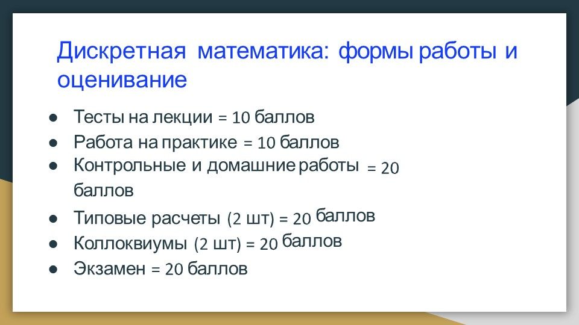
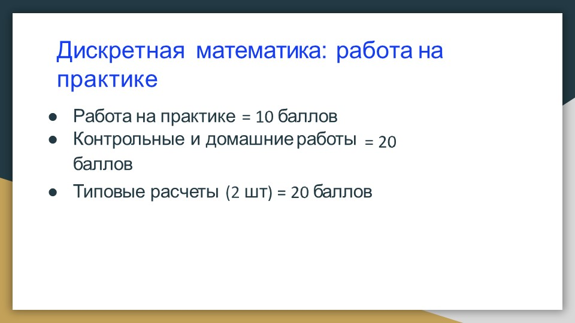
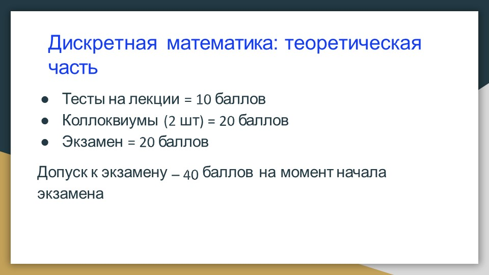
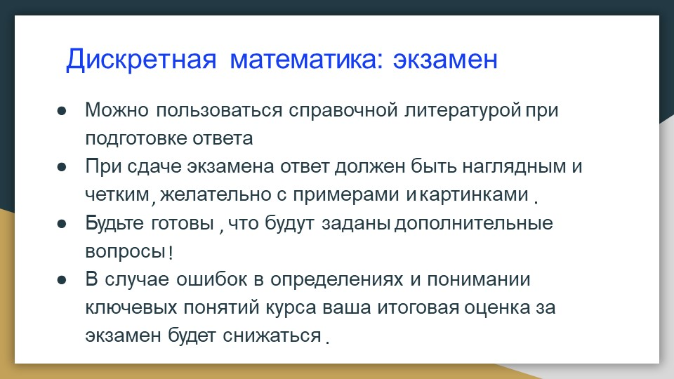
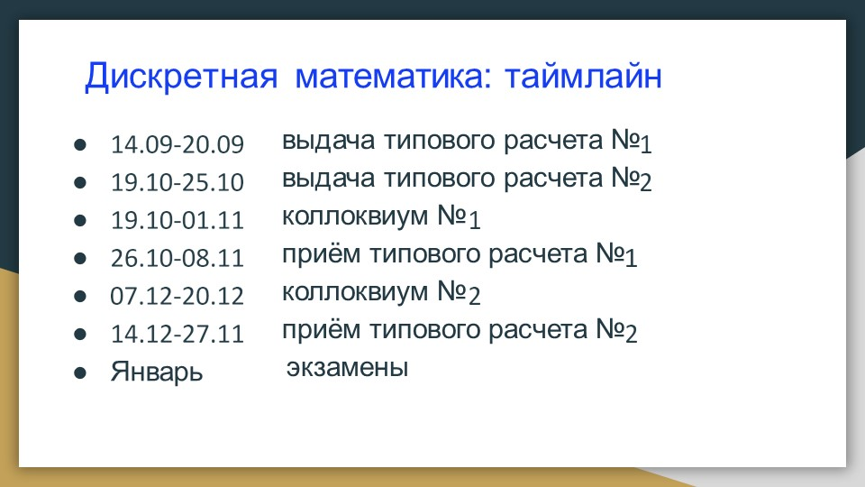

# Дискретная математика

## 1 семестр

### Лекции

**Преподаватель:** Буланова Нина Сергеевна 

**Формат:** дистанционно (стрим на твиче)

[Литература и материалы!](https://drive.google.com/drive/u/0/folders/19WCKf3qU5VC0JrMJ-EqwvDkFLOi1lOQb)

[Гугол док с оценками](https://docs.google.com/spreadsheets/d/1s_6PV40fFa0zKhZjKVN-v3FM9e0g05HGaTDSRmRgDLU/edit#gid=1728556842)

[Гугол док с планами Дискра + АиСД](https://docs.google.com/spreadsheets/d/1L2ja62S3xaAG9tGxOjSkV_20swbb0-o051aTwjcLyiA/edit#gid=1919232126)

[Стримы по Дискретки и АиСД тут](https://www.twitch.tv/ninokfox)

[Записи стримов тут](https://www.youtube.com/channel/UC6QpOmCIkQnAgQGusIbSgYw/videos)

[Конспект ИТМО](http://neerc.ifmo.ru/wiki/index.php?title=%D0%94%D0%B8%D1%81%D0%BA%D1%80%D0%B5%D1%82%D0%BD%D0%B0%D1%8F_%D0%BC%D0%B0%D1%82%D0%B5%D0%BC%D0%B0%D1%82%D0%B8%D0%BA%D0%B0)

### Практики

**Преподаватель:**  Чухнов Антон Сергеевич

### Домашние работы

[Типовик 1](DiscrHw/tipovik.pdf)

[ДЗ-1. Множества и немного бинарных отношений](DiscrHw/hw1.pdf)

[ДЗ-2. Бинарные отношения](DiscrHw/hw2.pdf)

### Разбалловка 

**Во второй строке снизу ошибка! (14.12-27.12)**